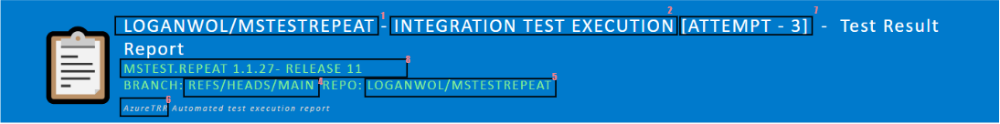
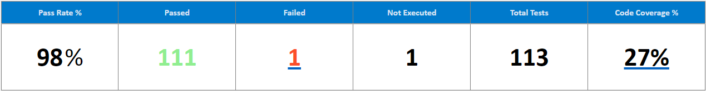

	

		

			
		

		

		AzTestReporter
		

	

    

Summarize Azure DevOps test results into a HTML report format that can be share via email.

## 1. Why?

## 2. Usage

### 2.1 Run the executable

### 2.2 Run via Azure Extensions.

### 2.3 Enable in Build Pipeline

### 2.4 Enable in Release Pipeline

## 3. Generated Reports
The tool supports generating reports for tests executed in both Build (Unit tests) and Release pipelines (Integration tests). 

Please view sample reports in the following links:

- 
- 
	 
The generated report is in HTML format that can be used to send out email to the team after execution of a pipeline. The report has several sections and below are descriptions of the contents of each section. 

1. Header section
2. Test Result summary section
2. Test class summary section
3. Code coverage section

### 3.1. Header Section
In this section all high level details about the test execution is listed. Below is a screenshot of how the header section for Unit tests and Integration tests would look.

#### Unit test report header

#### Integration test report header

To explain the multiple parts of the Header, I have highlighted the parts with reference numbers, with further details below. 

1. This represents the Repository name of the pipeline the report is run in.
2. This changes based on the context the report was generated in. 
	- In build pipeline: the value will always be "Unit"
	- In release pipeline: the value will change based on which Stage the tests were executed in. For example if there were 2 stages in the Release pipeline - "Execute Integration tests on Device 1", "Execute Integration tests on Device 2", the value will represent the stage in which the tool was run in. 
3. Only applicable in the Build pipeline, which represents the build number the tests are being executed for.
4. The name of the branch the build was picked up from.
5. The name of the repo the build was picked up from.
6. The Azure project the tests are being executed for. Here we assume that a project is associated with a specific team and hence the report should reflect the name of the team the report was generated for.
7. In release pipelines, stages can be executed more than once. When that's done, a new attempt is recorded in DevOps to identify the test run. The attempt number is attached to the header to give the user the specific context of the execution.
8. Only applicable to Release pipeline which represents the name of the Release the tests were executed in.

### 3.2 Test Result Summary section
This section is meant to provide the consumer of the report a quick glance overview of the results. There is a slight difference between the Unit test and Integration reports, where code coverage % is not added to Integration reports. This is mainly due to Azure DevOps not supporting querying for code coverage data on Release pipeline test runs. This section is very similar to what the user would see in the high level summary in Azure DevOps, with the numbers mirroring what Azure DevOps reports.

Some of the metrics above are self-explanatory. Here is an explanation of the ones that might need some description, below:

| Metric 		| Description                					                                   |
| ------------- | -------------------------------------------------------------------------------- |
| Pass Rate % 	| The pass rate based on all the tests executed &sum;Passing Tests/&sum;Tests Executed. |
| Not Executed	| Any test that wasn't a passing or a failed test is considered a 'Not Executed' test. |
| Code Coverage % | &sum;Total Blocks Covered/&sum;Total Code Blocks

Note - As mentioned earlier Code coverage is reported only for Build test results. Some requirements: 

* EnableCodeCoverage needs to be enabled in test execution. 
* If Code coverage results are converted to a different format like Cobertura or HTML and published, Azure DevOps does not convert the .coverage file data to a summary to be consumed by the tool.	

### 3.3 Test Class Summary section

## 4. What's next.

1. View Execution Environment details.
2. Ability to support custom template.
3. Output the datamodel into JSON for users to upload the json to datastore of their choice to enable data monitoring scenarios.
4. Code coverage reporting for Integration tests.