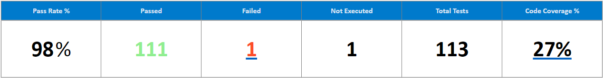
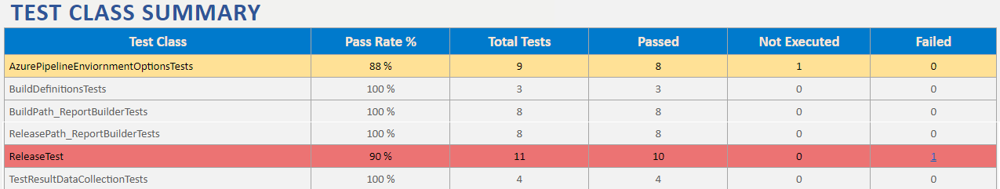
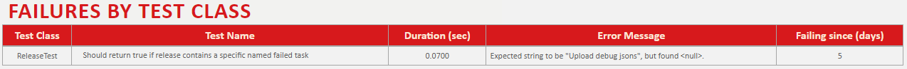
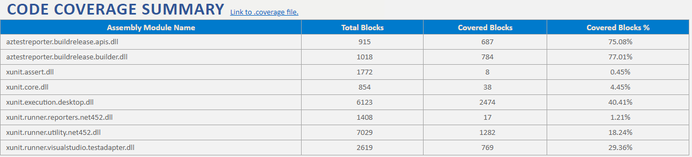

#  AzTestReporter - Report details

AzTestReporter generates report is in HTML format that can be used to send out email to the team after execution of a pipeline or the output HTML file can be use for custom purposes with subsequent tasks in the pipeline. There are 2 reports that are generated, 

1. *Successful Test run report*: Report with successful test execution, regardless of whether the test passed or failed.
2. *Failure Test run report* Report with a failure in test execution, where a task before the test run stage failed, possibly impacting the final result.

## 1. Successful Test run report
This report is generated whenever there are successful runs where all the tasks before the test execution task and the test execution task itself all successfully run. The report itself consists of several sections, below are descriptions of the contents of each section. 

1. Header section
2. Test Result summary table
3. Test class summary table
4. Failure summary table
5. Bug Summary table
6. Code coverage table

### 1.1. Header Table
In this section all high level details about the test execution is listed. Below is a screenshot of how the header section for Unit tests and Integration tests would look.

#### *Unit test report header*

#### *Integration test report header*

To explain the multiple parts of the Header, I have highlighted the parts with reference numbers, with further details below. 

1. This represents the Repository name of the pipeline the report is run in.
2. This changes based on the context the report was generated in. 
	- In build pipeline: the value will always be "Unit"
	- In release pipeline: the value will change based on which Stage the tests were executed in. For example if there were 2 stages in the Release pipeline - "Execute Integration tests on Device 1", "Execute Integration tests on Device 2", the value will represent the stage in which the tool was run in. 
1. Only applicable in the Build pipeline, which represents the build number the tests are being executed for.
4. The name of the branch the build was picked up from.
5. The name of the repo the build was picked up from.
6. The Azure project the tests are being executed for. Here we assume that a project is associated with a specific team and hence the report should reflect the name of the team the report was generated for.
7. In release pipelines, stages can be executed more than once. When that's done, a new attempt is recorded in DevOps to identify the test run. The attempt number is attached to the header to give the user the specific context of the execution.
8. Only applicable to Release pipeline which represents the name of the Release the tests were executed in.

### 1.2 Test Result Summary Table
This section is meant to provide the consumer of the report a quick glance overview of the results. There is a slight difference between the Unit test and Integration reports, where code coverage % is not added to Integration reports. This is mainly due to Azure DevOps not supporting querying for code coverage data on Release pipeline test runs. This section is very similar to what the user would see in the high level summary in Azure DevOps, with the numbers mirroring what Azure DevOps reports.

Some of the metrics above are self-explanatory. Here is an explanation of the ones that might need some description, below:

| Metric 		| Description                					                                   |
| ------------- | -------------------------------------------------------------------------------- |
| Pass Rate % 	| The pass rate based on all the tests executed &sum;Passing Tests/&sum;Tests Executed. |
| Not Executed	| Any test that wasn't a passing or a failed test is considered a 'Not Executed' test. |
| Code Coverage % | &sum;Total Blocks Covered/&sum;Total Code Blocks

Note - As mentioned earlier Code coverage is reported only for Build test results. Some requirements: 

* EnableCodeCoverage needs to be enabled in test execution. 
* If Code coverage results are converted to a different format like Cobertura or HTML and published, Azure DevOps does not convert the .coverage file data to a summary to be consumed by the tool.	

#### Links in the result summary table.
In order to enable easy navigation within the report, the failure and codecoverage metrics are displayed as links.
* Failed summary will link to the Failures table, the link will be enabled only if there is 1 or more failures.
* Code coverage will link to the Code Coverage table.

### 1.4 Test Class Summary Table
This table summarizes the results by the test class names that the tests are contained in, with similar metrics to what is reported in the Test Result Summary table. (see section 1.2 above) As code coverage data is only reported at a module level, test results by test class name is not available. 

* To show the different formats of the table, some of the results that highlight the same format have been removed from the above screenshot.

A couple of notes -
a. When there are test failures the test class row is highlighted in Red. 
b. When there are tests that were not executed, the test class row is highlighted in yellow.

### 1.5 Failure Summary Table
This table summarizes all the failures by Test class name. If multiple tests are failing for the same Test class, the test failures are organized such that the test class spans all the instances of test failures. 

The table shows a error message, not the stack of the failure. It also shows how long since the test started failing, to help diagnose the root cause of the failure, helping with the date range of the build that could have started the failure.

### 1.6 Bug Coverage Summary Table
::coming soon::

### 1.7 Code Coverage Summary Table
This table shows the summary results of code coverage by Total covered blocks, Covered Blocks and Coverage % for each module used in the test. 

To easily enable users to further investigate results, a convenient link to the original .coverage file is included right next to the summary header. Download the coverage file and view in Visual Studio or covert it to a readable HTML format using your favorite tools.

## 2. Execution Failure Test Report
The execution failure test report is meant to notify the team that there was an error in test execution of the Tests. There are 2 behaviors exhibited in AzTestReporter, 

1. In the Build pipeline, if there is a unit test error, a report with the test failure is generated. 
2. In the Release pipeline, if a failure happened before test execution a failure report with the task name that failed is generated. The failure report, shows the source of the failure and provides a link to the stage to further analyze and address the failure in the test pipeline.

The report itself is made up of similar sections as the Success test report, a Header section and based on the context of the failure, a Failures Summary table is shown or a Link to the Failed stage is shown. Here's a sample to the output report - ["ExecutionFailuresReport-Attempt0-1.1.37.html"]("ExecutionFailuresReport-Attempt0-1.1.37.html").
